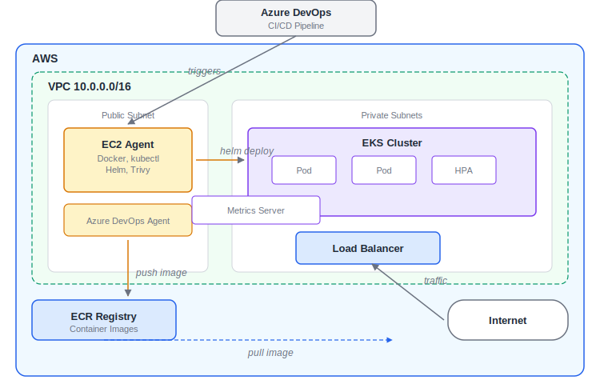
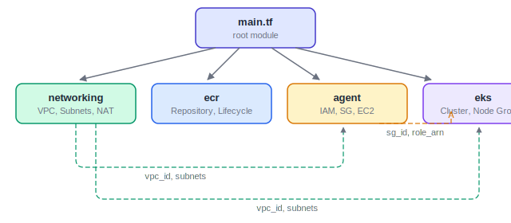
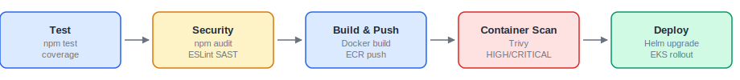
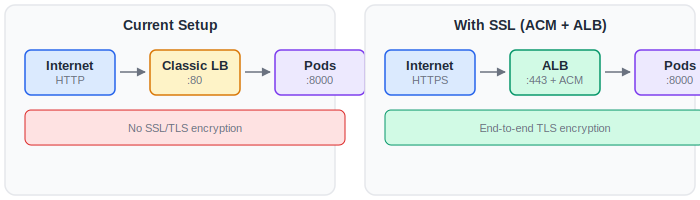
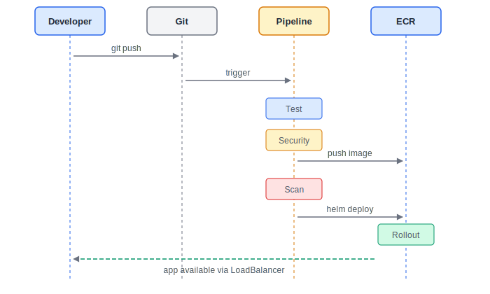

# DevOps Demo - Node.js

Node.js REST API deployed on AWS EKS with Terraform, Helm, and Azure DevOps.

**Stack**: Node.js 18 | Express | SQLite | Docker | Terraform | Helm | EKS | ECR | Azure DevOps

## Architecture



## Prerequisites

- AWS CLI configured with credentials
- Terraform >= 1.0.0
- Helm >= 3.0
- kubectl
- Node.js 18.15.0
- Docker

## Quick Start

```bash
npm install
npm run test
npm run start
```

API available at `http://localhost:8000/api/users`.

### Deploy infrastructure

```bash
cd aws
terraform init
terraform plan -var="enable_eks=true" -var="agent_key_name=your-key"
terraform apply -var="enable_eks=true" -var="agent_key_name=your-key"
```

### Deploy application

```bash
aws eks update-kubeconfig --region us-east-2 --name devsu-demo-eks

helm upgrade --install devsu-demo ./helm/devsu-demo \
  --namespace devsu --create-namespace \
  --set image.repository=ECR_REPO_URL \
  --set image.tag=IMAGE_TAG
```

## REST API

| Method | Endpoint | Description |
|--------|----------|-------------|
| `GET` | `/api/users` | List all users |
| `GET` | `/api/users/:id` | Get user by ID |
| `POST` | `/api/users` | Create user (`dni`, `name`) |

## Infrastructure - Terraform

The `aws/` directory uses 4 custom modules:



### Variables

| Variable | Type | Default | Description |
|----------|------|---------|-------------|
| `enable_eks` | `bool` | `false` | Enable EKS cluster creation |
| `aws_region` | `string` | `us-east-2` | AWS region |
| `project_name` | `string` | `devsu-demo` | Prefix for all resources |
| `vpc_cidr` | `string` | `10.0.0.0/16` | VPC CIDR block |
| `eks_node_instance_type` | `string` | `t3.medium` | EKS node instance type |
| `eks_node_desired_count` | `number` | `2` | Desired EKS worker nodes |
| `agent_instance_type` | `string` | `t3.medium` | CI/CD agent instance type |
| `agent_key_name` | `string` | `""` | SSH key pair for agent |

### State Migration

If migrating from the previous flat structure:

```bash
terraform state mv module.vpc module.networking.module.vpc
terraform state mv aws_ecr_repository.app module.ecr.aws_ecr_repository.this
terraform state mv aws_ecr_lifecycle_policy.app module.ecr.aws_ecr_lifecycle_policy.this
terraform state mv 'module.eks[0]' 'module.eks_cluster.module.eks[0]'
terraform state mv aws_iam_role.agent module.agent.aws_iam_role.this
terraform state mv aws_iam_role_policy.agent module.agent.aws_iam_role_policy.this
terraform state mv aws_iam_instance_profile.agent module.agent.aws_iam_instance_profile.this
terraform state mv aws_security_group.agent module.agent.aws_security_group.this
terraform state mv aws_instance.agent module.agent.aws_instance.this
terraform state mv data.aws_availability_zones.available module.networking.data.aws_availability_zones.available
terraform state mv data.aws_ami.amazon_linux module.agent.data.aws_ami.amazon_linux
```

## CI/CD Pipeline

5-stage Azure DevOps pipeline on a self-hosted EC2 agent:



| Stage | What it does |
|-------|-------------|
| **Test** | `npm test`, coverage report |
| **Security** | `npm audit` + ESLint SAST |
| **Build & Push** | Docker build, push to ECR |
| **Container Scan** | Trivy HIGH/CRITICAL scan |
| **Deploy** | `helm upgrade --install`, rollout wait |

## Helm Chart

Located at `helm/devsu-demo/`.

### Key parameters

| Parameter | Default | Description |
|-----------|---------|-------------|
| `image.repository` | `""` | ECR repository URL |
| `image.tag` | `latest` | Image tag |
| `replicaCount` | `2` | Replicas (ignored if HPA enabled) |
| `service.type` | `LoadBalancer` | K8s service type |
| `service.port` | `80` | External port |
| `autoscaling.enabled` | `true` | Enable HPA |
| `autoscaling.maxReplicas` | `10` | Max pods |
| `autoscaling.targetCPUUtilizationPercentage` | `70` | CPU scaling threshold |
| `ingress.enabled` | `false` | Enable Ingress for SSL |

## SSL and DNS

The app is exposed via a `LoadBalancer` service over HTTP. SSL is not enabled because:

1. No custom domain available (ACM requires DNS validation)
2. ALB + ACM + Route53 adds unnecessary cost for a demo
3. LoadBalancer provides a direct, functional endpoint




## Security

| Layer | Implementation |
|-------|----------------|
| **Network** | VPC with public/private subnets, NAT Gateway |
| **IAM** | Least-privilege roles for ECR and EKS |
| **Pipeline** | npm audit, ESLint SAST |
| **Container** | Alpine image, non-root user, Trivy scan, ECR scan-on-push |
| **Kubernetes** | Isolated namespace, Secrets, resource limits, health probes |

## Architecture Decisions

| Decision | Alternatives | Rationale |
|----------|-------------|-----------|
| EC2 self-hosted agent | Azure hosted agents | Full control, direct VPC access, no minute limits |
| ECR | DockerHub, Nexus | Native IAM integration with EKS |
| EKS | ECS, Docker Compose | Manifest portability, auto-scaling, industry standard |
| Terraform | CloudFormation, Pulumi | Multi-cloud, declarative, reusable modules |
| Helm | Raw manifests, Kustomize | Parameterized deploys, conditional resources |
| LoadBalancer | NodePort, Ingress + ALB | Simplicity for HTTP demo, Ingress documented for SSL |
| Trivy | Snyk, Grype | Open-source, no API key, runs offline |

## Developer Workflow



## Project Structure

```
devsu-devops-demo-nodejs/
├── aws/
│   ├── main.tf
│   ├── variables.tf
│   ├── outputs.tf
│   └── modules/
│       ├── networking/
│       ├── ecr/
│       ├── eks/
│       └── agent/
├── helm/
│   └── devsu-demo/
│       ├── Chart.yaml
│       ├── values.yaml
│       └── templates/
├── k8s/
├── azure-pipelines.yml
├── .eslintrc.json
├── Dockerfile
├── package.json
└── README.md
```

## Deliverables

1. **Repo**: https://github.com/darisjerez/devsu-devops-demo-nodejs
2. **Azure DevOps**: https://dev.azure.com/darisjerez/DevOps/_build
3. **Terraform**: `aws/` with 4 custom modules
4. **Helm chart**: `helm/devsu-demo/`
5. **App URL**: http://acf430b8f42d74fc28522f73e2e5395f-1995166995.us-east-2.elb.amazonaws.com

## License

Copyright 2023 Devsu. All rights reserved.
